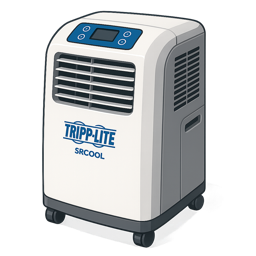

# Tripp Lite SRCOOL Custom Integration

[](https://github.com/Shaffer-Softworks/Tripp-light/actions/workflows/validate.yaml)
[](https://github.com/hacs/default)



> Control and monitor your Tripp Lite portable air conditioner from Home Assistant over Telnet.

**Supported hardware:** This integration works only with the [Tripp Lite SRCOOLNET SNMP Webcard Interface Module](https://tripplite.eaton.com/snmp-webcard-interface-module-remote-cooling-management-srcool12k-srxcool12k~SRCOOLNET) (Remote Cooling Management for SRCOOL12K / SRXCOOL12K). It does **not** support direct telnet to SRCOOL units without this adapter, and it does **not** support the SRCOOLNETLX adapter.

---

## Features

### Climate (`climate`)

- Set target temperature (**63 °F – 86 °F**)
- Fan speed: **Low**, **Medium**, **High**, **Auto**
- **Shut down** the unit from Home Assistant (see [Limitations](#limitations))

### Switch

- **Dehumidify Mode** — toggles the AC unit’s dehumidifying operating mode (separate from normal cooling). Use when you want the unit to focus on moisture removal rather than standard rack/room cooling.

### Binary sensor

- **Water Tank Full** — `on` when the condensate tank needs draining (useful for automations and notifications)

### Sensors

Status and identification values are exposed as individual sensors, including:

| Category | Examples |
|----------|----------|
| **Runtime** | Return air temperature, target temperature, operating mode, fan speed, auto fan, quiet mode, water status |
| **Identification** | Device name, vendor, product, serial number, location, region, asset tag, port name |
| **Preferences** | Units |
| **Card diagnostics** | OS, MAC address, driver/engine version, driver file status (hidden by default — see below) |

All entities attach to a single device in the Home Assistant device registry.

### Setup

- **Config flow** only (no YAML)
- **Reconfigure** / reauth when Telnet credentials change
- Brand images under `custom_components/tripp_lite_srcool/brand/` (Home Assistant **2026.3+**)

---

## Entities at a glance

| Entity | Type | Writable | Notes |
|--------|------|----------|-------|
| Tripp Lite SRCOOL | `climate` | Temp, fan, shutdown | COOL mode display only — cannot power on via telnet |
| Dehumidify Mode | `switch` | Yes | Independent of climate setpoint/fan |
| Water Tank Full | `binary_sensor` | No | Derived from water status text |
| Status sensors | `sensor` | No | One entity per telnet field |
| Card diagnostics | `sensor` (diagnostic) | No | Enable **Show diagnostic entities** on the device page |

---

## Dehumidify Mode

The **Dehumidify Mode** switch controls a separate operating mode on the AC unit (telnet **Devices → Preferences → Dehumidifying Status**):

- **Off** — normal cooling behavior
- **On** — unit runs in dehumidify mode

This is **not** the same as the climate card, fan speed, or water tank status:

- It does **not** turn cooling on or off by itself
- It is **not** a humidifier (the unit removes moisture when enabled)
- Running dehumidify for long periods may fill the condensate tank sooner — watch **Water Tank Full**

A read-only **Dehumidifying Status** sensor also exists but is hidden as a diagnostic entity (redundant with the switch).

---

## Limitations

The SRCOOLNET Telnet interface has important constraints:

| Topic | Behavior |
|-------|----------|
| **Power on** | **Not available** via telnet. Controls menu item `1` is **Reboot SNMP Card**, not start. Selecting **COOL** on the climate entity is ignored; only **OFF** (shutdown) is sent to the device. Power the unit on from the front panel or PowerAlert web UI. |
| **Polling** | One async Telnet session per host, **60 s** interval. A host-level lock prevents overlapping sessions during reconfigure validation. The adapter does not tolerate frequent or overlapping requests. |
| **Dependencies** | Requires **telnetlib3** (PyPI; auto-installed by Home Assistant). Python **3.13** compatible from v0.6.0+. |
| **Quiet mode** | Read-only — no telnet control path |
| **Diagnostics** | Card firmware/details refresh on startup and every **hour**; cached between refreshes |

---

## Device info

The device registry is populated from Telnet identification and diagnostics screens:

| Field | Source |
|-------|--------|
| Model | Product (e.g. SR(X)COOL12K) |
| Manufacturer | Vendor (Tripp Lite) |
| Firmware | PowerAlert **driver version** (card firmware) |
| Serial number | Unit serial from Identification screen |
| Configuration URL | `http://<host>` from integration settings |

The **Date Installed** sensor reflects when the card driver was installed — it is **not** the firmware version.

---

## Diagnostic entities

These sensors are categorized as **diagnostic** and hidden by default:

- Card: OS, agent type, MAC address, card serial, driver/engine version, driver file status
- Dehumidifying Status (raw text; use the **Dehumidify Mode** switch instead)

To show them: open the device page → **Device info** → enable **Show diagnostic entities**.

---

## Prerequisites

- Home Assistant Core **2024.9** or later (brand images require **2026.3+**)
- [HACS](https://hacs.xyz/) (recommended) or manual install
- Tripp Lite **SRCOOLNET** with Telnet enabled
- Network reachability from Home Assistant to the adapter

---

## Installation

### Using HACS

This integration is available in the [HACS default](https://github.com/hacs/default) feed. Search for **Tripp Lite SRCOOL** (or **Tripp-light**) and install it directly from HACS.

See the [official HACS documentation](https://hacs.xyz/docs/) for how to install and use HACS.

Restart Home Assistant after installation, then go to **Settings → Devices & services → Add integration** and search for **Tripp Lite SRCOOL**.

### Manually (not recommended)

1. Download the [latest release](https://github.com/Shaffer-Softworks/Tripp-light/releases) and copy [`custom_components/tripp_lite_srcool`](custom_components/tripp_lite_srcool) into your Home Assistant `config/custom_components/` directory.
2. Restart Home Assistant.
3. Add the integration as above.

---

## Configuration

| Field | Description |
|-------|-------------|
| Host | IP address or hostname of the SRCOOLNET adapter |
| Port | Telnet port (default `23`) |
| Username | Telnet username (often `localadmin`) |
| Password | Telnet password |

Use **Reconfigure** on the integration entry if credentials change. Reconfigure with **unchanged** credentials validates the existing session without opening a second connection. When credentials change, the live session disconnects briefly for validation, then the integration reloads. After upgrading to **0.6.0+**, reload the integration once so Home Assistant installs `telnetlib3`.

---

## Development

### Docker dev Home Assistant

Use the bundled compose stack to test the integration without touching production Home Assistant:

```bash
cd docker
docker compose up -d
```

Open **http://localhost:8125**, complete onboarding, then add **Tripp Lite SRCOOL**. The integration source is bind-mounted from this repo.

See [docker/README.md](docker/README.md) for logs, reload, reset, and verification scripts.

### Tests

```bash
pip install pytest pytest-asyncio pytest-homeassistant-custom-component telnetlib3
pytest tests/
```

---

## Support

- [Documentation](https://github.com/Shaffer-Softworks/Tripp-light)
- [Issues](https://github.com/Shaffer-Softworks/Tripp-light/issues)
